# Click 仓库架构图

> 仓库来源：https://github.com/pallets/click  
> 生成时间：自动生成

## 1. 架构总览

## 2. 模块依赖关系

```mermaid
graph LR
    docs_conf["docs/conf.py"]
    examples_aliases_aliases["examples/aliases/aliases.py"]
    examples_colors_colors["examples/colors/colors.py"]
    examples_completion_completion["examples/completion/completion.py"]
    examples_complex_complex_cli["examples/complex/complex/cli.py"]
    examples_complex_complex_commands_cmd_init["examples/complex/complex/commands/cmd_init.py"]
    examples_complex_complex_commands_cmd_status["examples/complex/complex/commands/cmd_status.py"]
    examples_imagepipe_imagepipe["examples/imagepipe/imagepipe.py"]
    examples_inout_inout["examples/inout/inout.py"]
    examples_naval_naval["examples/naval/naval.py"]
    examples_repo_repo["examples/repo/repo.py"]
    examples_termui_termui["examples/termui/termui.py"]
    examples_validation_validation["examples/validation/validation.py"]
    src_click___init__["src/click/__init__.py"]
    src_click__compat["src/click/_compat.py"]
    src_click__termui_impl["src/click/_termui_impl.py"]
    src_click__textwrap["src/click/_textwrap.py"]
    src_click__utils["src/click/_utils.py"]
    src_click__winconsole["src/click/_winconsole.py"]
    src_click_core["src/click/core.py"]
    src_click_decorators["src/click/decorators.py"]
    src_click_exceptions["src/click/exceptions.py"]
    src_click_formatting["src/click/formatting.py"]
    src_click_globals["src/click/globals.py"]
    src_click_parser["src/click/parser.py"]
    src_click_shell_completion["src/click/shell_completion.py"]
    src_click_termui["src/click/termui.py"]
    src_click_testing["src/click/testing.py"]
    src_click_types["src/click/types.py"]
    src_click_utils["src/click/utils.py"]
    tests_conftest["tests/conftest.py"]
    tests_test_arguments["tests/test_arguments.py"]
    tests_test_basic["tests/test_basic.py"]
    tests_test_chain["tests/test_chain.py"]
    tests_test_command_decorators["tests/test_command_decorators.py"]
    tests_test_commands["tests/test_commands.py"]
    tests_test_compat["tests/test_compat.py"]
    tests_test_context["tests/test_context.py"]
    tests_test_custom_classes["tests/test_custom_classes.py"]
    tests_test_defaults["tests/test_defaults.py"]
    tests_test_formatting["tests/test_formatting.py"]
    tests_test_imports["tests/test_imports.py"]
    tests_test_info_dict["tests/test_info_dict.py"]
    tests_test_normalization["tests/test_normalization.py"]
    tests_test_options["tests/test_options.py"]
    tests_test_parser["tests/test_parser.py"]
    tests_test_shell_completion["tests/test_shell_completion.py"]
    tests_test_stream_lifecycle["tests/test_stream_lifecycle.py"]
    tests_test_termui["tests/test_termui.py"]
    tests_test_testing["tests/test_testing.py"]
    tests_test_types["tests/test_types.py"]
    tests_test_utils_test_KeepOpenFile["tests/test_utils/test_KeepOpenFile.py"]
    tests_test_utils_test_LazyFile["tests/test_utils/test_LazyFile.py"]
    tests_test_utils_test__detect_program_name["tests/test_utils/test__detect_program_name.py"]
    tests_test_utils_test__expand_args["tests/test_utils/test__expand_args.py"]
    tests_test_utils_test_confirm["tests/test_utils/test_confirm.py"]
    tests_test_utils_test_echo["tests/test_utils/test_echo.py"]
    tests_test_utils_test_echo_via_pager["tests/test_utils/test_echo_via_pager.py"]
    tests_test_utils_test_format_filename["tests/test_utils/test_format_filename.py"]
    tests_test_utils_test_make_default_short_help["tests/test_utils/test_make_default_short_help.py"]
    tests_test_utils_test_open_file["tests/test_utils/test_open_file.py"]
    tests_test_utils_test_prompt["tests/test_utils/test_prompt.py"]
    tests_test_utils_test_sentinel["tests/test_utils/test_sentinel.py"]
    tests_test_utils_test_style["tests/test_utils/test_style.py"]
    tests_typing_typing_aliased_group["tests/typing/typing_aliased_group.py"]
    tests_typing_typing_confirmation_option["tests/typing/typing_confirmation_option.py"]
    tests_typing_typing_group_kw_options["tests/typing/typing_group_kw_options.py"]
    tests_typing_typing_help_option["tests/typing/typing_help_option.py"]
    tests_typing_typing_options["tests/typing/typing_options.py"]
    tests_typing_typing_password_option["tests/typing/typing_password_option.py"]
    tests_typing_typing_progressbar["tests/typing/typing_progressbar.py"]
    tests_typing_typing_simple_example["tests/typing/typing_simple_example.py"]
    tests_typing_typing_version_option["tests/typing/typing_version_option.py"]
```

## 3. 核心模块说明

| 模块 | 职责 |
|------|------|
| `src/click/core.py` | 核心框架：Context、Command、Group、Parameter 等基类 |
| `src/click/decorators.py` | 装饰器 API：@click.command()、@click.option() 等 |
| `src/click/types.py` | 参数类型系统：Choice、IntRange、Path、File 等 |
| `src/click/parser.py` | 命令行参数解析器 |
| `src/click/formatting.py` | 帮助文本格式化 |
| `src/click/termui.py` | 终端 UI：进度条、分页、颜色等 |
| `src/click/testing.py` | 测试工具：CliRunner |
| `src/click/exceptions.py` | 异常体系 |
| `src/click/utils.py` | 工具函数：文件操作、echo 等 |
| `src/click/globals.py` | 全局上下文管理 |
| `src/click/shell_completion.py` | Shell 自动补全（bash/zsh/fish/powershell） |
